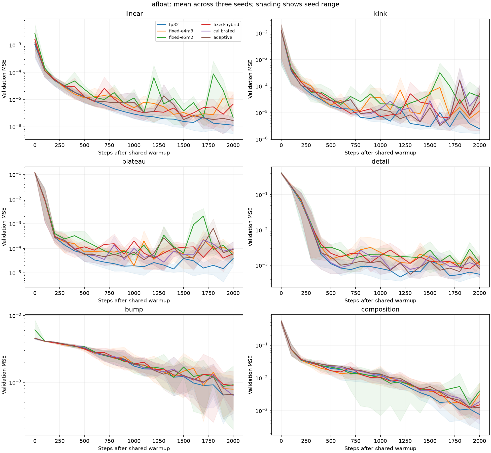
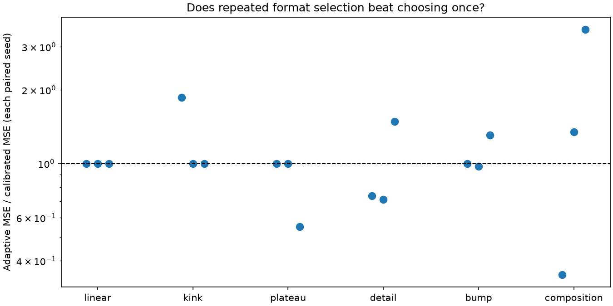

# afloat: prototype results

Measured September 10, 2026. **All 108 planned training runs completed without a
numerical failure. Repeated format selection did not consistently improve on
choosing each array's format once.** This is an exploratory result from three
seeds, not a rejection of adaptive number representations in general.

The strongest limitation is that the experiment barely changed formats:
more than 99.99% of adaptive weight and gradient element evaluations used E3M4.
All 190 format switches affected the single output bias or its gradient.
No hidden-layer array switched. The small sine feature was also not learned
reliably by FP32, so this study cannot establish whether adaptation preserves it.

CPU was sufficient. The complete accuracy study took **269.69 seconds** with
three independent seed processes. Separate serial measurements found median
training times of **0.493 ms/update for FP32** and **2.546 ms/update for adaptive**.
Prepared-weight inference took about **0.080 ms for one example** or
**0.124 ms for a batch of 128** in every condition. These are software simulation
timings; arithmetic remains FP32.

## What ran

The [experiment design](docs/experiment.md) defines the functions and controls.
The source revision was `b3573e0167f466c1e0579b0b832ce47f2c65cd1b`, with a clean
working tree and identical source hashes in all three seed runs.

| Setting | Value |
| --- | --- |
| Network | 9,585 parameters; three residual feed-forward blocks, each with ReLU, tanh, and SiLU |
| Targets | linear, kink, plateau, detail, bump, composition |
| Conditions | FP32; fixed E4M3; fixed E5M2; E4M3 weights/E5M2 gradients; chosen once; chosen repeatedly |
| Repeats | Seeds 0, 1, 2, paired by initialization, optimizer state, and training examples |
| Training | 50 shared FP32 warmup updates, then 2,000 updates per condition |
| Optimizer | Adam, learning rate 0.001; batches of 128 newly sampled examples |
| Selection | Every 100 updates; minimum rounding MSE over up to 2,048 sampled array entries |
| Validation | Fixed 65 × 65 grid; measured after every 100 updates, including step 0 |
| Activation probes | 512 fixed examples; all nine activation groups at each measurement |
| Hardware | Apple M5 Pro, 18 CPU cores, 48 GiB RAM; no GPU |
| Software | Python 3.13.14, PyTorch 2.14.0, NumPy 2.5.3, Matplotlib 3.11.1 |

MSE means mean squared error: smaller is better. E3M4, E4M3, and E5M2 split the
bits between exponent range and fractional precision, with one additional sign
bit. Every low-precision condition recalculates a power-of-two scale for each
whole array at every use. Only the choice of format differs. We round weights
and parameter gradients; master weights, optimizer state, activations, and
arithmetic remain FP32. Neither bfloat16 nor arbitrary learned value sets were
conditions in this study.

The budget and stopping rule were recorded before these runs. The main outcome
is validation MSE at exactly 2,000 updates; no best checkpoint or best fixed
format was selected after looking at validation results. This remains exploratory:
the preliminary runs informed development, and three seeds provide limited
information about variation across initializations.

## Training and inference time

The performance pass ran **after the accuracy runs and analysis had finished**,
in one process with one PyTorch CPU thread. All 108 conditions were measured in
a recorded, shuffled order. Each training measurement timed 300 consecutive
updates from the shared warmup checkpoint, after five throwaway warmup updates
on a separate copy. Data generation, weight rounding, forward calculation,
backward calculation, gradient rounding, Adam, and the existing rounding
statistics are included. Validation, reference-gradient probes, file writes,
plots, checkpoint loading, and initial format calibration are excluded.

Every timed training result matched its original step-300 validation MSE. Every
cached inference weight array exactly matched its saved final representation.
Inference and preparation used at least 0.1 seconds total across repeated timing
blocks per measurement; raw block times and the middle-half spread are saved. Training
was timed once per target/seed/condition. The table reports medians over the 18
target/seed cases for each condition, not 18 repeated timings of identical weights.

| Condition | Training ms/update | Training examples/s | Inference ms, batch 1 | Inference ms, batch 128 | Prepare weights ms |
| --- | --- | --- | --- | --- | --- |
| fp32 | 0.493 | 259,796 | 0.0800 | 0.1236 | 0.013 |
| fixed-e4m3 | 2.470 | 51,827 | 0.0796 | 0.1237 | 0.603 |
| fixed-e5m2 | 2.496 | 51,279 | 0.0798 | 0.1236 | 0.609 |
| fixed-hybrid | 2.481 | 51,592 | 0.0794 | 0.1238 | 0.606 |
| calibrated | 2.511 | 50,978 | 0.0792 | 0.1229 | 0.627 |
| adaptive | 2.546 | 50,276 | 0.0797 | 0.1235 | 0.626 |

The adaptive/calibrated ratio of median update times was 1.014; this one pass
cannot resolve such a small difference reliably. Adaptive training was 5.17
times the FP32 median because this implementation explicitly simulates rounding.
That does not predict the speed of hardware that directly supports the formats.

Inference uses final rounded weights already stored as FP32 arrays. Consequently,
all conditions execute the same kind of arithmetic and have similar typical
latency. Batch-128 inference processes about one million examples per second.
Preparing rounded weights is a separate, usually one-time cost: approximately
0.6 ms, excluding format search. FP32 preparation only constructs the parameter
mapping. Calling preparation before every request would add that cost.

| Condition | Training ms/update, observed range | Seconds elapsed at final validation, mean [range] |
| --- | --- | --- |
| fp32 | 0.473–0.506 | 1.39 [1.26–1.63] |
| fixed-e4m3 | 2.388–2.519 | 8.52 [7.46–10.51] |
| fixed-e5m2 | 2.373–2.591 | 8.55 [7.73–10.15] |
| fixed-hybrid | 2.393–2.760 | 8.67 [7.53–9.32] |
| calibrated | 2.418–2.785 | 8.47 [7.58–8.85] |
| adaptive | 2.431–2.795 | 8.53 [7.58–9.20] |

The last column describes the actual accuracy runs with three processes active,
through completion of final validation. It includes earlier measurements and
file writes, but excludes shared warmup, initial calibration, final metric writes,
the final activation probe, and checkpoint saving. It is **not** a serial
training-speed comparison. The
whole-study wall time includes startup, warmup, logging, and plots. The separate
performance pass took 111.15 seconds. There were timing outliers: batch-128 FP32
latency reached 0.213 ms in one case despite its 0.124 ms median. Per-case ranges
and raw repeated timings are in the
[performance evidence](docs/evidence/full-study/performance/measurements.jsonl).
We did not measure time to reach a common accuracy threshold, packed memory,
energy use, GPU inference, or native eight-bit arithmetic.

## Approximation accuracy

Final validation MSE, **mean ± sample standard deviation across three seeds**:

| Target | fp32 | fixed-e4m3 | fixed-e5m2 | fixed-hybrid | calibrated | adaptive |
| --- | --- | --- | --- | --- | --- | --- |
| linear | 1.15e-06 ± 5.2e-07 | 1.14e-05 ± 6.9e-06 | 2.25e-06 ± 1e-06 | 6.77e-06 ± 8.2e-06 | 1.71e-06 ± 5.9e-07 | 1.71e-06 ± 5.9e-07 |
| kink | 2.48e-06 ± 1.4e-06 | 1.15e-05 ± 1.4e-05 | 4.04e-05 ± 3.2e-05 | 2.51e-05 ± 3.9e-05 | 4.99e-05 ± 5.2e-05 | 5.11e-05 ± 5.1e-05 |
| plateau | 3.83e-05 ± 3.1e-05 | 6.86e-05 ± 3.9e-05 | 5.37e-05 ± 2.3e-05 | 5.98e-05 ± 2.1e-05 | 9.62e-05 ± 8e-05 | 9.01e-05 ± 8.6e-05 |
| detail | 0.000558 ± 8e-05 | 0.00103 ± 0.00051 | 0.00118 ± 0.00062 | 0.00127 ± 0.00055 | 0.000942 ± 0.00072 | 0.000802 ± 0.00045 |
| bump | 0.000658 ± 0.0004 | 0.000786 ± 0.00044 | 0.000916 ± 0.00078 | 0.0009 ± 0.00056 | 0.000633 ± 0.00042 | 0.00065 ± 0.00037 |
| composition | 0.000762 ± 0.00044 | 0.00322 ± 0.0033 | 0.00396 ± 0.0027 | 0.0015 ± 0.0014 | 0.00187 ± 0.0025 | 0.00123 ± 0.00053 |

FP32 had the lowest mean error on five targets. On `bump`, calibrated had the
lowest mean, with large variation across seeds. The target functions have
different scales; averaging these raw errors across targets would obscure that.
The curves also show that several rounded conditions fluctuate, making the
fixed final-update rule consequential.



To isolate the value of *repeated* selection, compare adaptive with calibrated.
These ratios are adaptive MSE divided by calibrated MSE for the same seed;
**below 1 favors adaptive**. Ties are exact equality of recorded final MSE.

| Target | Seed 0 | Seed 1 | Seed 2 | Adaptive wins / ties / losses |
| --- | --- | --- | --- | --- |
| linear | 1.000 | 1.000 | 1.000 | 0 / 3 / 0 |
| kink | 1.860 | 1.000 | 1.000 | 0 / 2 / 1 |
| plateau | 1.000 | 1.000 | 0.552 | 1 / 2 / 0 |
| detail | 0.736 | 0.715 | 1.485 | 2 / 0 / 1 |
| bump | 1.000 | 0.974 | 1.305 | 1 / 1 / 1 |
| composition | 0.351 | 1.348 | 3.536 | 1 / 0 / 2 |

No target had a strict adaptive win on all three seeds. The mean improvement
on `composition` was driven by seed 0; seeds 1 and 2 became worse.
The comparison with every other control is retained below. Each entry is the
ratio of the two three-seed means, which differs from averaging the seed ratios.

| Target | fp32 | fixed-e4m3 | fixed-e5m2 | fixed-hybrid | calibrated |
| --- | --- | --- | --- | --- | --- |
| linear | 1.486 | 0.150 | 0.759 | 0.253 | 1.000 |
| kink | 20.633 | 4.427 | 1.264 | 2.035 | 1.024 |
| plateau | 2.350 | 1.312 | 1.678 | 1.506 | 0.936 |
| detail | 1.437 | 0.776 | 0.678 | 0.630 | 0.851 |
| bump | 0.987 | 0.827 | 0.710 | 0.722 | 1.027 |
| composition | 1.614 | 0.382 | 0.311 | 0.822 | 0.657 |

Adaptive beat fixed E4M3 on all three seeds for `linear`, `detail`, and `bump`,
but lost on all three for `kink`. Reduced rounding error therefore did not
reliably translate into better function approximation. The full paired
absolute differences, ratios, wins, and ties are in
[paired-comparisons.json](docs/evidence/full-study/analysis/paired-comparisons.json).



## Did the network learn the intended features?

Selected feature measurements below use the same mean ± standard deviation.
All fixed-format feature results are also included in
[statistics.json](docs/evidence/full-study/analysis/statistics.json).

| Measurement | fp32 | calibrated | adaptive |
| --- | --- | --- | --- |
| kink: near slope changes | 4.86e-06 ± 1.9e-06 | 4.17e-05 ± 4.7e-05 | 4.22e-05 ± 4.6e-05 |
| plateau: transition | 5.38e-05 ± 3.4e-05 | 0.000147 ± 4.4e-05 | 0.000122 ± 5.7e-05 |
| plateau: outside transition | 3.46e-05 ± 4.3e-05 | 8.41e-05 ± 9.2e-05 | 8.25e-05 ± 9.3e-05 |
| bump: inside radius 0.15 | 0.0151 ± 0.016 | 0.0179 ± 0.015 | 0.0197 ± 0.018 |
| bump: outside radius 0.15 | 0.000408 ± 0.00014 | 0.000333 ± 0.00017 | 0.00032 ± 7.6e-05 |
| detail: fitted amplitude (target 0.01) | 0.000178 ± 0.00014 | -7.5e-05 ± 0.00081 | 0.000671 ± 0.00016 |
| detail: isolated component error ratio | 1.63 ± 0.23 | 2.82 ± 1.3 | 2.9 ± 0.67 |

For `kink`, the transition region is within 0.1 of either input axis. For
`plateau`, it is where `abs(x1 + 0.5 x2) <= 0.2`. For `bump`, the inner region is
within radius 0.15 of its center. FP32's bump error was 14.1% of the error of the
best constant prediction on the grid: a substantial but incomplete fit.

The `detail` target has a small sine amplitude of 0.01. FP32 recovered a mean
amplitude of only 0.000178, or 1.78% of the intended amplitude. A **diagnostic added
after seeing the runs** subtracts each fixed-x1 row's mean over x2 from both
prediction and truth, then divides their squared discrepancy by the true small
component's squared magnitude. A prediction with no x2 dependence scores 1.
All three FP32 seeds scored worse than that, from 1.36 to 1.79. This diagnostic
supports the existing amplitude measurement; it was not used to select formats
or checkpoints. Lower total MSE on `detail` cannot be described as successful
preservation of its small feature.

[Target and prediction images](docs/evidence/full-study/analysis/function-surfaces.png)
show the broad fits. Their shared color range within each target cannot resolve
the tiny sine component, so the numerical feature measurements are essential.

The nonlinear functions do exercise different parts of the network. At the
final FP32 checkpoint, averaging equal-sized activation groups across the three
layers and three seeds gives:

| Target | ReLU negative | ReLU near zero | tanh small slope | tanh mean slope | SiLU small slope |
| --- | --- | --- | --- | --- | --- |
| linear | 51.00% | 17.73% | 0.00% | 0.914 | 0.01% |
| kink | 52.21% | 16.15% | 0.00% | 0.920 | 0.00% |
| plateau | 51.45% | 11.33% | 1.01% | 0.804 | 0.27% |
| detail | 53.48% | 8.05% | 1.07% | 0.805 | 0.53% |
| bump | 56.88% | 9.80% | 0.00% | 0.847 | 0.31% |
| composition | 53.44% | 5.67% | 2.22% | 0.736 | 0.78% |

“Near zero” means absolute input below 0.1. “Small slope” means absolute derivative
below 0.01, so an input change has little immediate effect on that activation.
ReLU sees both signs on every target. The `composition` target produces more
small-slope tanh and SiLU values than `linear` or `kink`, but even there such
values are uncommon. We have observed different usage, not proved that any one
activation family caused a result. No activation gain sweep or single-family
network comparison was run. Initial/final input percentiles, maximum magnitudes,
slopes, and rounding effects for every condition are in
[activations.csv](docs/evidence/full-study/analysis/activations.csv).

## What happened to formats, rounding, and gradients?

Across all adaptive runs there were **22 weight-format switches and 168
gradient-format switches**, out of 5,472 reselection opportunities for each kind
of array. Every switch was on `4.bias`, the one-element output bias, or its
gradient. More than 99.99% of element evaluations used E3M4; the remainder used
E4M3. E5M2 was never selected by either custom condition. The hidden weight and
gradient arrays stayed with E3M4 throughout.

This makes a permanently fixed E3M4 control a useful missing comparison. The
chosen-once condition uses E3M4 for nearly every element, but an explicit
fixed-E3M4 run was not part of the six-condition study. Current evidence tests
repeated selection only weakly. The same three-format family may be too limited,
and these array distributions may be too stable, to expose its intended benefit.

The following rounding measurements cover every update and weight/gradient
entry, then average the 18 equally sized target/seed cases. “Made zero” counts
nonzero values rounded to zero, divided by **all entries**, including entries
that were already zero. Different conditions develop different weights and
gradients, so these aggregate errors do not compare identical arrays.

| Condition | Weight rounding MSE | Weights made zero | Gradient rounding MSE | Gradients made zero |
| --- | --- | --- | --- | --- |
| fixed-e4m3 | 8.49e-06 | 0.00053% | 1.29e-08 | 0.01656% |
| fixed-e5m2 | 3.41e-05 | 0.00000% | 6.33e-08 | 0.00018% |
| fixed-hybrid | 8.47e-06 | 0.00051% | 5e-08 | 0.00004% |
| calibrated | 2.13e-06 | 0.12997% | 3.42e-09 | 1.87241% |
| adaptive | 2.12e-06 | 0.13112% | 3.41e-09 | 1.84490% |

There were **zero clipped entries** across 5,760,000 array records. The shared
maximum-based scale rule is designed to fit the largest entry, so this is not
independent evidence that adaptation prevents clipping. Adaptive scales ranged
from 2^-13 to 2^-4 for weights and from 2^-32 to 2^-4 for gradients. All scales,
format shares, switch counts, and initial/final array counts are summarized in
[formats.csv](docs/evidence/full-study/analysis/formats.csv); every actual switch
is retained in [format-changes.csv](docs/evidence/full-study/analysis/format-changes.csv).

Choosing E3M4 roughly quarters weight rounding MSE compared with E4M3 in these
runs, while making more small values zero. This is a tradeoff, and the selection
rule directly minimizes rounding MSE; improvement on that quantity alone is
not evidence for better training.

The next table describes the **final sampled update**, averaged across the 18
target/seed cases. The first three columns measure gradient direction agreement:
1 means the same direction, 0 means perpendicular, and -1 means opposite.
The reference is each condition's current FP32 master-weight gradient on the
same batch, not the separately trained FP32 model.

| Condition | Gradient rounding alone | Weight rounding alone | Both together | Both: gradient MSE | ReLU sign changes |
| --- | --- | --- | --- | --- | --- |
| fp32 | 1.0000 | 1.0000 | 1.0000 | 0 | 0.000% |
| fixed-e4m3 | 0.9996 | 0.0540 | 0.0537 | 2.03e-05 | 0.638% |
| fixed-e5m2 | 0.9987 | 0.3222 | 0.3237 | 8.74e-05 | 1.394% |
| fixed-hybrid | 0.9987 | 0.3393 | 0.3384 | 2.38e-05 | 0.621% |
| calibrated | 0.9999 | 0.6778 | 0.6779 | 5.96e-06 | 0.320% |
| adaptive | 0.9999 | 0.4208 | 0.4209 | 7.15e-06 | 0.312% |

Rounding the gradient itself changed its direction little. Computing the gradient
with rounded weights could change it much more. These are local sensitivity
measurements, not proof of what caused later learning behavior. ReLU sign changes
compare rounded and master-weight evaluations on the fixed probes. Mean
nonlinear-output errors and final output differences are preserved alongside
all gradient errors in the evidence; they are descriptive measurements on
different learned states, not a common-weight ranking of formats.

## Selection cost and representation size

Initial selection for both custom conditions took a mean **6.50 ms** per
shared target/seed checkpoint. Adaptive's 19 later reselections took a total
mean **99.24 ms** per 2,000-update run, or **105.74 ms** including initial
selection. These are measured under the concurrent accuracy workload. The
serial 300-update benchmark independently recorded a median **9.47 ms** for its
two later reselections. This shorter block therefore cannot exactly extrapolate
the full run's adaptation overhead. Rounding and scale calculation costs remain
present on every update even when no format is reselected.

For one set of weights plus parameter gradients, every eight-bit condition
reserves 153,360 payload bits, 1,024 scale bits, and 64 format-identifier bits:
**19,306 bytes**, including 136 bytes of metadata. The equivalent FP32 element
payload is 76,680 bytes. These are calculated representation budgets, not
measured process-memory savings. FP32 master weights, optimizer state,
activations, and simulation arrays are additional storage; no bit packing was
implemented. Fixed modes reserve the same identifier allowance as custom modes.

## Earlier measurements

The preliminary run contained 36 conditions, seed 0 only, 10 warmup updates,
100 subsequent updates, and reselection every 20 updates. All completed.
The table compares its FP32/adaptive final losses with seed 0 of the full study;
the [initial evidence](docs/evidence/initial/summary.json) retains all six modes.

| Target | 100 steps: fp32 | 2,000 steps: fp32 | 100 steps: adaptive | 2,000 steps: adaptive |
| --- | --- | --- | --- | --- |
| linear | 9.67e-05 | 5.67e-07 | 9.78e-05 | 1.13e-06 |
| kink | 0.00118 | 1.58e-06 | 0.00119 | 7.74e-06 |
| plateau | 0.0482 | 7.42e-05 | 0.0459 | 0.000188 |
| detail | 0.368 | 0.000647 | 0.372 | 0.0013 |
| bump | 0.00414 | 0.000424 | 0.00414 | 0.000553 |
| composition | 0.12 | 0.00108 | 0.126 | 0.00167 |

Adaptive and calibrated were identical on every preliminary target. Those runs
established execution, not an adaptation benefit. Longer training greatly
improved the broad fits, but warmup length and reselection interval also changed,
so this is not a controlled comparison of training duration alone. The small
feature remains unlearned after the longer run.

## Verification and reproducibility

The analysis verified all three source identities and all 528 manifest entries,
108 final checkpoints, 2,268 metric rows, 5,760,000 format records, and 20,412
activation records. It independently recalculated all saved final feature errors
from prediction arrays. The performance pass matched all 108 step-300 validation
losses and exactly checked all cached final representations. Matching one scalar
loss does not prove equality of intermediate training states. A separate reviewer recomputed
manifest hashes, final prediction errors, paired comparisons, and benchmark
summary values. These checks establish what was measured; they do not establish
an adaptive-format advantage.

Project checks and final review are recorded in
[the study audit](docs/evidence/full-study/audit.md).
The earlier [implementation validation](docs/validation.md) separately documents
format boundary tests, standard FP8 agreement, gradient-probe isolation,
calibration accounting, failure recording, and CLI execution. Software checks
are not learning results.

From a clean checkout with dependencies installed, reproduce the full workflow:

```sh
uv sync --locked
mkdir -p runs
afloat_study=$(mktemp -d runs/full-study.XXXXXX)
uv run python scripts/run_study.py --output "$afloat_study/study"
uv run python scripts/analyze_study.py "$afloat_study/study" \
  --output "$afloat_study/analysis"
uv run python scripts/benchmark_study.py "$afloat_study/study" \
  --output "$afloat_study/performance"
make check
make smoke
```

Run these sequentially so analysis and training do not compete with timing.
The launcher records its current clean revision. The measured training source
and dependency lock are identified by the published source hashes; the reporting
scripts were added afterward. For the original local artifacts, rerun analysis
or benchmarking against `runs/full-study.NzhhwC`, always choosing a new output
directory. Each seed's `source/` directory preserves the exact original training
code and lock; the CLI also supports replaying a saved configuration.

The [published evidence](docs/evidence/full-study) contains all validation and
gradient measurement rows, final feature statistics, format/activation summaries,
paired comparisons, figures, raw performance timing blocks, configurations,
source hashes, and original manifests. Full checkpoints and per-update logs
remain in the ignored local `runs/` directory and can be regenerated. The
published manifests describe those original complete run directories, not just
the compact evidence copy.

## What this establishes, and what remains open

**Ready as a prototype measurement report. Adaptive benefit needs evidence.**
This CPU experiment can compare format rules during training and expose changes
in error, activation behavior, and runtime. The repeated-selection condition
showed no consistent advantage over choosing once, and switching was confined
to one scalar parameter. That result does not settle whether richer adaptive
representations help other models or changing distributions.

A stronger next experiment should first make the small feature learnable on
separate development seeds, include fixed E3M4, and deliberately vary activation
input ranges or the distribution within arrays. It should verify that substantial
arrays actually change preferred formats before asking whether those changes
improve held-out approximation. More fresh seeds and a time-to-accuracy comparison
would then address reliability and practical cost. Hardware speed remains a
separate, unmeasured question.
